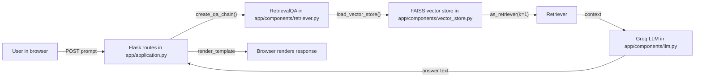
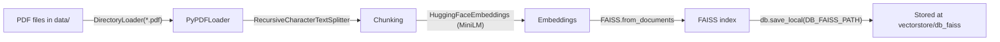

# RAG Medical Assistant (AI Medical Chatbot)

This repository provides a simple “ask questions about your PDFs” chatbot using Retrieval-Augmented Generation (RAG):

- Documents: loads `*.pdf` files from `data/`
- Index: splits documents into chunks, embeds them, and stores them in a local FAISS vector store
- Query: retrieves the most relevant chunk(s) and asks a Groq-hosted LLM to answer using only the retrieved context
- UI: a small Flask web app with a chat-like interface

> Medical disclaimer: This project is for informational purposes and is not medical advice. Always consult a qualified clinician for diagnosis or treatment decisions.

This project’s CI/CD uses **Google Cloud** (Artifact Registry + **Cloud Run**), as defined in [`Jenkinsfile`](Jenkinsfile). If you adapt the pipeline for another cloud (for example AWS), replace the deploy and registry stages accordingly.

## Clone the repository

```bash
git clone https://github.com/fatirmalik1/agentic-medical-assistant.git
cd agentic-medical-assistant
```

If you use a fork, replace the URL with your fork’s clone URL.

## Prerequisites checklist

Use this before local runs or CI/CD:

**Local app**

- [ ] Python **3.10+** (matches [`Dockerfile`](Dockerfile) base image `python:3.10-slim`)
- [ ] A **Groq API key** (`GROQ_API_KEY`)
- [ ] PDFs under `data/` and a built FAISS index at `vectorstore/db_faiss` before asking questions

**Optional: Docker (app image)**

- [ ] **Docker Desktop** (or Docker Engine) running
- [ ] [`Dockerfile`](Dockerfile) present at repo root

**Optional: Jenkins pipeline (as in this repo)**

- [ ] **Docker** on the machine or agent that runs Jenkins (pipeline runs `docker build` / `docker push`)
- [ ] **Trivy** installed where the pipeline runs (`trivy image ...` in [`Jenkinsfile`](Jenkinsfile))
- [ ] **Google Cloud SDK** (`gcloud`) installed where the pipeline runs
- [ ] GCP service account JSON stored in Jenkins as a **Secret file** credential whose ID matches `GCP_CRED_ID` in [`Jenkinsfile`](Jenkinsfile) (default: `gcp-jenkins-sa`)
- [ ] [`custom_jenkins/Dockerfile`](custom_jenkins/Dockerfile) if you run Jenkins in Docker (see [Jenkins in Docker (optional)](#jenkins-in-docker-optional))

## Architecture & Data Flow

### Runtime (query -> answer)



### Vector store build (PDFs -> FAISS)



## What the repo runs

The Flask app entrypoint is `app/application.py`:

- `GET /` renders the chat UI (`app/templates/index.html`)
- `POST /` takes the form field `prompt`, runs the RetrievalQA chain, then appends the assistant response to `session["messages"]`
- `GET /clear` clears `session["messages"]`

The UI template formats chat messages using a small `nl2br` filter (`app/templates/index.html`).

## Key Configuration (Environment Variables)

The repo uses `python-dotenv` via `load_dotenv()` (so you can keep secrets in a local `.env` file).

### Required

- `GROQ_API_KEY`: used by `app/components/llm.py` to create a `ChatGroq` instance

### Optional / depending on your environment

- `HF_TOKEN`: defined in `app/config/config.py` and loaded from `.env`, but embeddings are created with `HuggingFaceEmbeddings(...)` without explicitly passing a token in code
- `PORT`: controls the Flask server port (default is `8080`)

## Data Files and Paths

These paths are **relative to the repo working directory** (run commands from the repo root):

- PDFs input directory: `data/` (configured by `DATA_PATH` in `app/config/config.py`)
- Vector store output directory: `vectorstore/db_faiss` (configured by `DB_FAISS_PATH` in `app/config/config.py`)

Chunking settings:

- `CHUNK_SIZE = 500`
- `CHUNK_OVERLAP = 50`

## Setup (Local)

### 1) Create a virtual environment and install dependencies

**macOS / Linux**

```bash
python3 -m venv venv
source venv/bin/activate
```

**Windows (Command Prompt)**

```bat
python -m venv venv
venv\Scripts\activate
```

**Install dependencies** (choose one; both are valid for this repo)

- **Editable install (same approach as [`Dockerfile`](Dockerfile))** — installs the `app` package and dependencies from [`setup.py`](setup.py) / [`requirements.txt`](requirements.txt):

```bash
pip install -e .
```

- **Requirements file only:**

```bash
pip install -r requirements.txt
```

### 2) Prepare PDFs

Create `data/` and place your PDF files in it:

- `data/*.pdf`

### 3) Configure environment variables

Create a local `.env` (it is ignored by git via `.gitignore`) with at least:

```bash
GROQ_API_KEY=your_groq_key
```

### 4) Build the FAISS vector store

Run the vector store builder (from the repo root):

```bash
python app/components/data_loader.py
```

This will load PDFs from `data/`, chunk them, embed them, and write the FAISS index to `vectorstore/db_faiss`.

### 5) Start the Flask app

```bash
python app/application.py
```

Open:

- `http://localhost:8080`

## How to Use the Chat

1. Type a medical question in the input box.
2. The app runs a `RetrievalQA` chain created by `create_qa_chain()`:
   - Retriever: `k=1` (it uses only the top retrieved chunk)
   - Prompt: a custom template in `app/components/retriever.py` instructs the model to answer in **2–3 lines maximum** using **only** the retrieved context
   - `return_source_documents=False` (no citations are currently returned in the UI)
3. The chat history is stored in the Flask session and reset if the server restarts (because `app.secret_key` is generated per start).
4. Use `/clear` (the “Clear Chat” button) to reset the session messages.

## Run with Docker

### Build

```bash
docker build -t rag-medcal-assistant .
```

### Run

```bash
docker run --rm \
  -p 8080:8080 \
  -e GROQ_API_KEY="$GROQ_API_KEY" \
  -e HF_TOKEN="$HF_TOKEN" \
  rag-medcal-assistant
```

**If you built the vector store on the host**, mount it (and optionally `data/`) so the container sees the same paths as in [`app/config/config.py`](app/config/config.py) (`vectorstore/db_faiss`, `data/`):

```bash
docker run --rm \
  -p 8080:8080 \
  -e GROQ_API_KEY="$GROQ_API_KEY" \
  -e HF_TOKEN="$HF_TOKEN" \
  -v "$(pwd)/vectorstore:/app/vectorstore" \
  -v "$(pwd)/data:/app/data" \
  rag-medcal-assistant
```

On Windows PowerShell you can use `${PWD}` instead of `$(pwd)` for the host paths.

Note: the app expects the FAISS index to already exist at `vectorstore/db_faiss`. If you only run the container without building the vector store inside it, you must either:

- Build `vectorstore/db_faiss` on your host and mount/copy it into the container, or
- Run the vector store build step inside the container before starting Flask (for example `docker run -it ... bash` then `pip install -e .`, add PDFs under `data/`, run `python app/components/data_loader.py`, then `python app/application.py`)

## CI/CD and Cloud Run

### What the `Jenkinsfile` does

The pipeline in [`Jenkinsfile`](Jenkinsfile):

1. Checks out the repo (default remote URL is set in the file; change it if you use a fork)
2. Builds a Docker image (tagged with the Jenkins build number) for `linux/amd64`
3. Runs a **Trivy** vulnerability scan (`trivy image --exit-code 0 --severity HIGH,CRITICAL ...`). To **fail the build** on high/critical findings, change `--exit-code 0` to `--exit-code 1` in the `Jenkinsfile`
4. Authenticates to **GCP** with a service account key and pushes the image to **Artifact Registry**
5. Deploys to **Cloud Run** with `--allow-unauthenticated`

Values you will normally customize in [`Jenkinsfile`](Jenkinsfile) (see `environment { ... }`):

- `PROJECT_ID` — GCP project ID
- `REGION` — e.g. `us-central1`
- `REPOSITORY` — Artifact Registry repository name
- `SERVICE_NAME` — Cloud Run service name
- `GCP_CRED_ID` — Jenkins **Secret file** credential ID for the GCP service account JSON
- Checkout `url` — Git remote if not using `fatirmalik1/agentic-medical-assistant`

### Jenkins agent requirements

The pipeline shell steps expect **`docker`**, **`trivy`**, and **`gcloud`** on the PATH of the Jenkins agent (or inside the Jenkins container if you run Jenkins in Docker). If any command is missing, the corresponding stage will fail.

### GCP credentials in Jenkins

1. Create (or reuse) a GCP service account with permissions to push to Artifact Registry and deploy to Cloud Run (as appropriate for your org).
2. Download the JSON key.
3. In Jenkins: **Manage Jenkins** → **Credentials** → add **Secret file**, upload the JSON, and set the credential **ID** to match `GCP_CRED_ID` (default in this repo: `gcp-jenkins-sa`).

### Cloud Run runtime configuration

After deploy, configure the Cloud Run service with the same secrets the app needs locally:

- `GROQ_API_KEY` (required)
- `HF_TOKEN` (optional, if your embeddings model download requires it)

You can set these in the Google Cloud Console (Cloud Run → service → Edit → Variables & secrets) or with `gcloud run services update`.

Cloud Run sets `PORT`; [`app/application.py`](app/application.py) uses `PORT` with default `8080`, which matches typical Cloud Run behavior.

### GitHub and Jenkins (optional)

If the repository is **private**, configure Git credentials in Jenkins (for example a GitHub **personal access token** scoped to `repo`) and use Jenkins **Pipeline Syntax** → **checkout** to generate a `checkout` block, or add `credentialsId` to the `userRemoteConfigs` in [`Jenkinsfile`](Jenkinsfile). For a **public** repo, the checkout URL alone may be enough.

### Create the pipeline job and run it

1. In Jenkins: **New Item** → **Pipeline** → name it (for example `medical-rag-pipeline`) → OK.
2. Under **Pipeline**, choose **Pipeline script from SCM**, SCM **Git**, repository URL your clone URL, branch `*/main` (or match [`Jenkinsfile`](Jenkinsfile)).
3. Save, then **Build Now**.

If the [`Jenkinsfile`](Jenkinsfile) lives only in Git, commit and push it:

```bash
git add Jenkinsfile
git commit -m "Add Jenkinsfile for CI pipeline"
git push origin main
```

## Jenkins in Docker (optional)

This is a typical **Jenkins in Docker** setup (Jenkins container with the host Docker socket mounted), using this repo’s [`custom_jenkins/Dockerfile`](custom_jenkins/Dockerfile). **Port 8080** here is the **Jenkins UI**, not the Flask app—run the chatbot on another port (e.g. `PORT=5000 python app/application.py`) while Jenkins uses 8080.

### 1) Build the Jenkins image

From the **repository root**:

```bash
docker build -t jenkins-medical ./custom_jenkins
```

### 2) Run the Jenkins container

**macOS / Linux** (bash):

```bash
docker run -d \
  --name jenkins-medical \
  --privileged \
  -p 8080:8080 \
  -p 50000:50000 \
  -v /var/run/docker.sock:/var/run/docker.sock \
  -v jenkins_home:/var/jenkins_home \
  jenkins-medical
```

**Windows (Command Prompt)** — use Docker Desktop paths as needed; line continuation with `^`:

```bat
docker run -d ^
  --name jenkins-medical ^
  --privileged ^
  -p 8080:8080 ^
  -p 50000:50000 ^
  -v //var/run/docker.sock:/var/run/docker.sock ^
  -v jenkins_home:/var/jenkins_home ^
  jenkins-medical
```

### 3) Initial admin password and UI

```bash
docker logs jenkins-medical
# or, if the password does not appear in logs:
docker exec jenkins-medical cat /var/jenkins_home/secrets/initialAdminPassword
```

Open **http://localhost:8080** and complete the setup wizard.

### 4) Install tools inside the Jenkins container (typical)

The default `jenkins/jenkins` image may not include **Python**, **Trivy**, **gcloud**, or the **Docker CLI**. Install what your pipeline needs, for example:

```bash
docker exec -u root -it jenkins-medical bash
apt-get update -y
apt-get install -y python3 python3-pip
ln -sf /usr/bin/python3 /usr/bin/python
# Trivy (example — check https://github.com/aquasecurity/trivy/releases for current version)
curl -LO https://github.com/aquasecurity/trivy/releases/download/v0.62.1/trivy_0.62.1_Linux-64bit.deb
dpkg -i trivy_0.62.1_Linux-64bit.deb
# Google Cloud SDK — follow https://cloud.google.com/sdk/docs/install for your environment
exit
docker restart jenkins-medical
```

You also need the **`docker` CLI** available to the `jenkins` user if stages run `docker build` / `docker push`. Options include installing `docker-ce-cli` in the container or using an agent image that already includes Docker. If you see permission errors on `/var/run/docker.sock`, on the host (or as root in the container) you may need to align socket permissions and group membership:

```bash
docker exec -u root -it jenkins-medical bash
chown root:docker /var/run/docker.sock
chmod 660 /var/run/docker.sock
usermod -aG docker jenkins
exit
docker restart jenkins-medical
```

(Group id `998` for `docker` in [`custom_jenkins/Dockerfile`](custom_jenkins/Dockerfile) is a best-effort match to the host; adjust if your host’s `docker` group id differs.)

## Code Walkthrough (By Module)

- `app/application.py`
  - Flask app + routes (`/` and `/clear`)
  - Stores chat messages in `session["messages"]`
  - Calls `create_qa_chain()` and then `qa_chain.invoke({"query": user_input})`

- `app/components/retriever.py`
  - Defines `CUSTOM_PROMPT_TEMPLATE` (2–3 line medical QA with context)
  - Implements `create_qa_chain()`
  - Loads vector store + Groq LLM and creates `RetrievalQA.from_chain_type(...)`

- `app/components/llm.py`
  - Implements `load_llm(...)` using `ChatGroq`
  - Default `model_name="llama-3.1-8b-instant"`

- `app/components/embeddings.py`
  - Implements `get_embedding_model()` using `sentence-transformers/all-MiniLM-L6-v2`

- `app/components/vector_store.py`
  - `load_vector_store()` loads FAISS from `DB_FAISS_PATH` if it exists
  - `save_vector_store(text_chunks)` builds and saves a FAISS index

- `app/components/pdf_loader.py`
  - `load_pdf_files()` loads `data/*.pdf` via `DirectoryLoader` + `PyPDFLoader`
  - `create_text_chunks(documents)` splits into chunks using `RecursiveCharacterTextSplitter`

- `app/components/data_loader.py`
  - Orchestrates the full “PDFs -> vector store” flow in `process_and_store_pdfs()`

- `app/config/config.py`
  - Loads `.env`
  - Provides constants like `DB_FAISS_PATH`, `DATA_PATH`, `CHUNK_SIZE`, `CHUNK_OVERLAP`

- `app/common/logger.py` and `app/common/custom_exception.py`
  - `logger` writes to `logs/log_YYYY-MM-DD.log`
  - exceptions include file and line info in their message

- `app/templates/index.html`
  - The chat UI template (simple HTML + inline CSS)

## Troubleshooting

### Vector store not found / empty

Symptoms:

- The retriever fails with an error like “Vector store not present or empty”

Fix:

- Ensure `vectorstore/db_faiss` exists
- Rebuild it using:
  - `python app/components/data_loader.py`

### No PDFs found

Symptoms:

- The PDF loader logs “No pdfs were found”
- The vector store builder may fail because no documents/chunks were produced

Fix:

- Ensure `data/` exists
- Add at least one `*.pdf` file under `data/`

### Groq/LLM errors

Symptoms:

- LLM fails to load or you get authentication errors

Fix:

- Ensure `GROQ_API_KEY` is set in your environment or `.env`

### Container starts but questions fail

Symptoms:

- The app runs, but `create_qa_chain()` returns `None` and you see an error in the UI

Fix:

- The container image does not automatically build the FAISS index at runtime
- Ensure `vectorstore/db_faiss` exists inside the running container (build it ahead of time or copy/mount it)

### Jenkins UI and Flask both want port 8080

Symptoms:

- Jenkins is running in Docker on `http://localhost:8080` and you cannot reach the Flask app on the same port

Fix:

- Run Flask on another port: `PORT=5000 python app/application.py` (then open `http://localhost:5000`), or stop the Jenkins container while testing the app locally

### Pipeline fails: `trivy: not found` or `gcloud: not found`

Fix:

- Install **Trivy** and **Google Cloud SDK** on the Jenkins agent or inside the Jenkins container (see [Jenkins in Docker (optional)](#jenkins-in-docker-optional))


